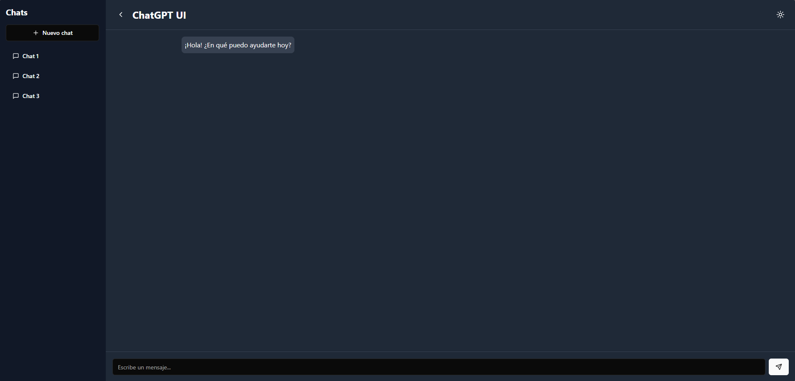

# Clone Chat
## Descripción
Clone Chat es una aplicación de chat que permite a los usuarios comunicarse en tiempo real. La aplicación soporta temas claros y oscuros y tiene una interfaz de usuario intuitiva.
## Instalación
Para instalar las dependencias del proyecto, ejecuta:
```sh
pnpm install
```
## Ejecución
Para iniciar la aplicación en modo de desarrollo, ejecuta:
```sh
pnpm dev
```
